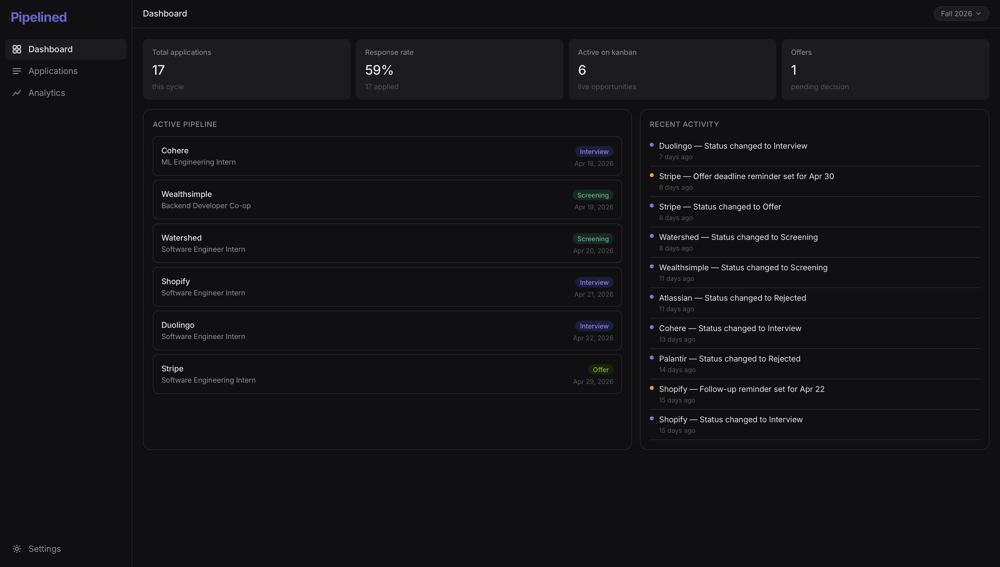
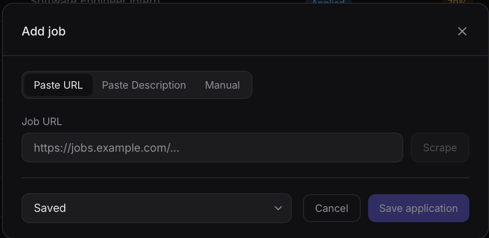
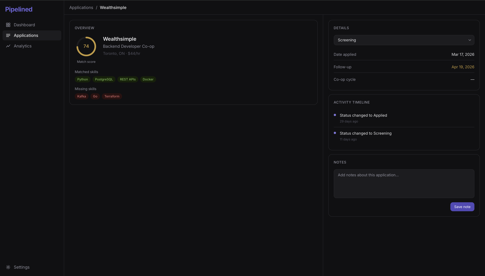
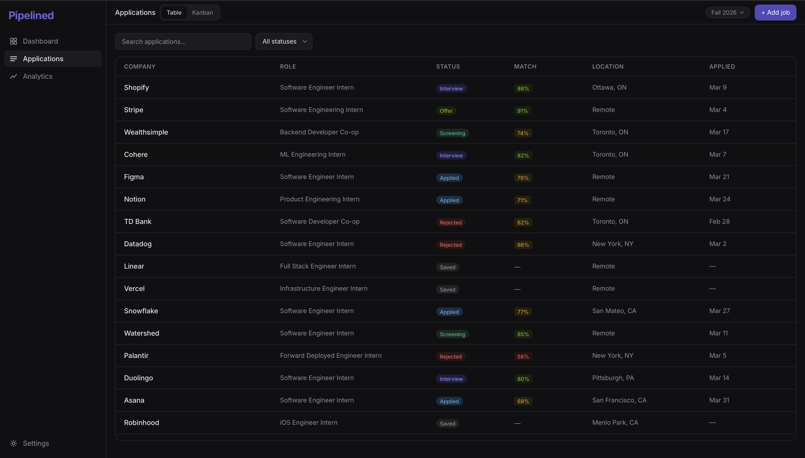
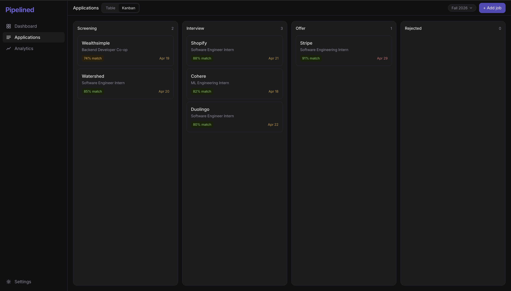
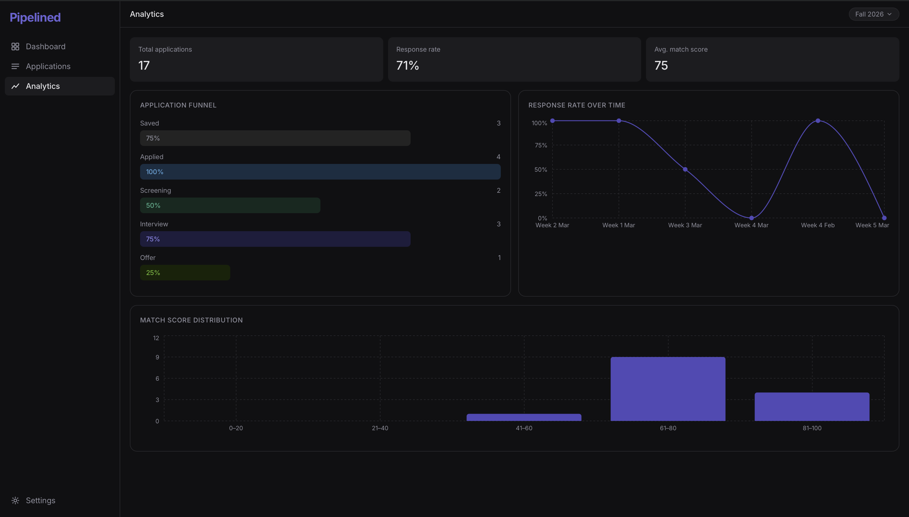

# Pipelined

**Your co-op pipeline, from application to offer.**

Pipelined is a full-stack job application tracker built for Waterloo co-op students. Paste a job URL and it auto-fills the details, scores your resume against the job description using a custom ML model, and tracks your entire application pipeline from saved to offer.

<!-- SCREENSHOT: Full dashboard view showing stats cards, active pipeline with Shopify/Wealthsimple/TD Bank cards, and recent activity feed. Use a wide browser window. -->


---

## Features

- **Auto-fill from URL** — paste a Greenhouse or Lever job URL and the app scrapes company, role, location, salary, and job description automatically
- **AI parsing** — paste any job description (WaterlooWorks, LinkedIn) and Gemini extracts structured fields
- **ML match scoring** — custom Python microservice scores your resume against the job description using sentence-transformers and cosine similarity, returning a match score and matched/missing skills
- **Application table** — sortable, searchable, filterable spreadsheet of all your applications across a co-op cycle
- **Kanban pipeline** — drag-and-drop board for active opportunities (phone screen, interview, offer). Jobs surface onto the kanban when a recruiter responds and return to the table when rejected
- **Activity timeline** — every status change and note logged with timestamps per application
- **Co-op cycles** — data persists across recruiting cycles (Fall 2026, Winter 2027, etc.) with cycle-level analytics
- **Analytics** — funnel chart, response rate over time, match score distribution


---

## Tech Stack

| Layer | Tech |
|---|---|
| Frontend | Next.js 16, TypeScript, Tailwind CSS |
| Backend | Next.js API Routes, Prisma ORM |
| Database | PostgreSQL (Neon) |
| Auth | NextAuth.js, bcrypt |
| ML service | Python, FastAPI, sentence-transformers, scikit-learn |
| Scraping | beautifulsoup4 (static), Playwright (dynamic) |
| AI parsing | Gemini API |
| Email | Resend + Vercel Cron |
| Deployment | Vercel (Next.js) + Railway (Python) |

---

## Architecture

Pipelined is split across two deployed services:

- **Vercel** — Next.js frontend and thin API routes. Handles auth, PDF parsing, Gemini API calls, and database operations
- **Railway** — Python FastAPI microservice. Handles web scraping (beautifulsoup4 for static sites, Playwright for JavaScript-rendered sites like Workday) and ML match scoring (sentence-transformers + cosine similarity)

Next.js API routes forward scraping and scoring requests to Railway via HTTP. The ML model loads once on service start and stays in memory for fast subsequent requests.

<!-- SCREENSHOT: Architecture diagram or just the add job modal showing the three tabs (Paste URL, Paste description, Manual) with a scraped result auto-filled -->


---

## ML Scoring

The match scoring pipeline:

1. User uploads resume PDF in settings — parsed to text with `pdf-parse`, stored on the User model
2. When a job is added, `resumeText` and `jobDescription` are sent to the Railway `/match` endpoint
3. `all-MiniLM-L6-v2` (sentence-transformers) encodes both texts into dense vector embeddings
4. Cosine similarity between the two vectors produces a match score (0–100)
5. Skill keywords are extracted and compared to produce `matchedSkills[]` and `missingSkills[]`

<!-- SCREENSHOT: Application detail page showing the match score ring (e.g. 82), matched skills in green pills (React, TypeScript, REST APIs), and missing skills in red pills (Go, Kubernetes) -->


---

## Scraping

Two strategies based on the target URL:

- **beautifulsoup4** — for static HTML sites (Greenhouse, Lever). Makes an HTTP request and parses the server-rendered HTML directly
- **Playwright** — for JavaScript-rendered sites (Workday, most enterprise career pages). Runs a headless Chromium browser that executes JavaScript and waits for content to load before parsing

Platform detection happens automatically based on the URL — the user just pastes a link.

For sites that block scrapers (LinkedIn, WaterlooWorks), the app falls back to the paste + Gemini AI parse flow.

---

## Application Lifecycle

```
SAVED → APPLIED → (ghosted, stays in table)
                 ↓ recruiter responds
           PHONE SCREEN → INTERVIEW → OFFER
                 ↓ rejected at any stage
               REJECTED (leaves kanban, returns to table)
```

- **Table** — holds all applications (SAVED, APPLIED, REJECTED and ghosted)
- **Kanban** — shows only active opportunities (PHONE SCREEN, INTERVIEW, OFFER)
- Changing status to PHONE_SCREEN or higher automatically surfaces the card onto the kanban
- Changing to REJECTED immediately removes the card from the kanban

<!-- SCREENSHOT: Applications page showing table view with status badges, match score rings, and search bar at top. Include a mix of statuses (Applied, Interview, Offer, Rejected) -->


<!-- SCREENSHOT: Applications page switched to kanban view showing Phone Screen, Interview, Offer, Rejected columns with cards. Ideally show a card being dragged between columns -->


---

## Analytics

<!-- SCREENSHOT: Analytics page showing the funnel chart (full width bars tapering from Saved → Applied → Phone Screen → Interview → Offer) and the response rate line chart side by side -->


---

## Pages

| Page | Route | Description |
|---|---|---|
| Dashboard | `/dashboard` | Stats cards, active pipeline snapshot, recent activity |
| Applications | `/applications` | Table and kanban view of all applications |
| Detail | `/applications/[id]` | Job description, match score, skills, notes, timeline |
| Analytics | `/analytics` | Funnel chart, response rate, match score distribution |
| Settings | `/settings` | Resume upload, co-op cycle management, email preferences |

---

## Data Models

```prisma
User          — id, email, name, resumeText
CoopCycle     — id, userId, term, year
Application   — id, userId, cycleId, company, role, status,
                matchScore, matchedSkills[], missingSkills[],
                salary, location, remote, dateApplied,
                deadline, followUpDate, jobDescription
Activity      — id, applicationId, type, description, createdAt
```

---

## Getting Started

### Prerequisites

- Node.js 18+
- Python 3.10+
- PostgreSQL database (Neon recommended)
- Railway account (for Python service)

### 1. Clone the repo

```bash
git clone https://github.com/yourusername/pipelined.git
cd pipelined
```

### 2. Install dependencies

```bash
npm install
```

### 3. Set up environment variables

```bash
cp .env.example .env
```

Fill in your `.env`:

```env
DATABASE_URL=""
NEXTAUTH_SECRET=""
NEXTAUTH_URL="http://localhost:3000"
GEMINI_API_KEY=""
RESEND_API_KEY=""
ML_SERVICE_URL="http://localhost:8000"
```

### 4. Set up the database

```bash
npx prisma migrate dev
```

### 5. Run the Next.js app

```bash
npm run dev
```

### 6. Run the Python ML service

```bash
cd ml-service
pip install -r requirements.txt
uvicorn main:app --reload --port 8000
```

Visit `http://localhost:3000`

---

## Deployment

- **Next.js** — deployed on [Vercel](https://vercel.com). Connect your GitHub repo and set environment variables in the Vercel dashboard.
- **Python service** — deployed on [Railway](https://railway.app). Connect your GitHub repo, set `ML_SERVICE_URL` in Vercel to point to your Railway deployment URL.
- **Database** — [Neon](https://neon.tech) serverless PostgreSQL.

---

## Screenshots Guide

> Replace placeholders above with actual screenshots. Recommended browser window width: 1440px. Use your real application data for authenticity.

| File | What to capture |
|---|---|
| `screenshots/dashboard.png` | Full dashboard — stats row + active pipeline + activity feed |
| `screenshots/add-job.png` | Add job modal — URL tab with a scraped result auto-filled |
| `screenshots/match-score.png` | Detail page — score ring, matched skills, missing skills visible |
| `screenshots/table.png` | Applications table — mix of statuses, search bar, match scores |
| `screenshots/kanban.png` | Kanban view — all four columns with cards |
| `screenshots/analytics.png` | Analytics — funnel + line chart side by side |

---

## License

MIT